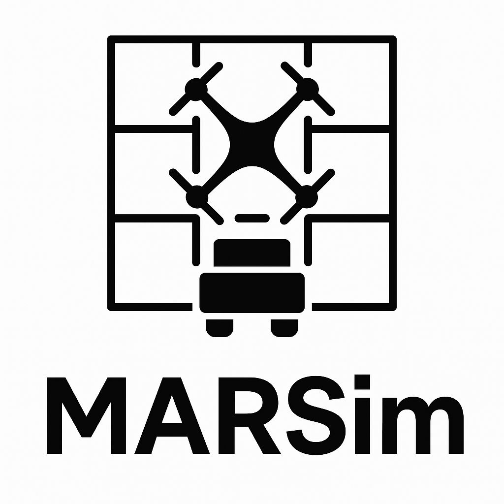
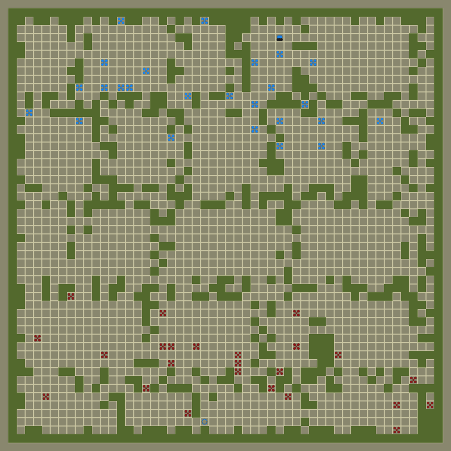
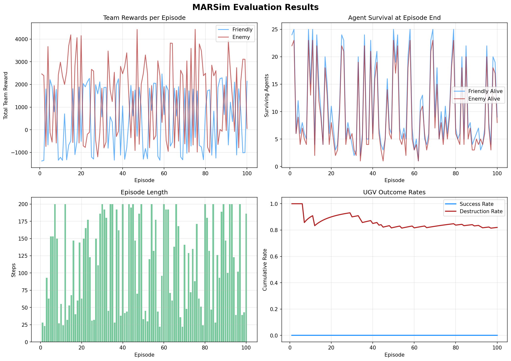

<p align="center">
  
</p>

<h1 align="center">MARSim — Multi-Agent Resupply Simulator</h1>

<p align="center">
  <a href="#installation">Installation</a> •
  <a href="#quick-start">Quick Start</a> •
  <a href="#environment-details">Environment</a> •
  <a href="#training">Training</a> •
  <a href="#evaluation">Evaluation</a> •
  <a href="#configuration">Configuration</a> •
  <a href="#project-structure">Structure</a> •
  <a href="#license">License</a>
</p>

---

**MARSim** is an open-source multi-agent reinforcement learning (MARL) environment for studying autonomous decision-making in contested logistics scenarios. Inspired by real-world challenges in battlefield resupply, MARSim provides a grid-based abstraction where **UAVs** (Unmanned Aerial Vehicles) and **UGVs** (Unmanned Ground Vehicles) must coordinate to deliver supplies while an adversarial team attempts to intercept them.

<p align="center">
  
  <br/>
  <em>Friendly UAVs (blue) escort a UGV through a treeline battlefield while enemy UAVs (red) attempt to intercept.</em>
</p>

## Key Features

- **Multi-agent adversarial environment** with 4 agent types (Friendly UAV/UGV, Enemy UAV/UGV)
- **Gymnasium-compatible** API — drop-in with standard RL libraries
- **Procedural map generation** — corridor-style "treeline" battlefields with tunable parameters
- **4 collision systems** — from simple priority to full UAV-vs-UAV combat with kamikaze mechanics
- **Built-in PPO baseline** — train agents out of the box
- **A\* pathfinding** for UGV navigation with incremental map learning
- **Real-time Pygame visualisation** with supersampled anti-aliasing
- **Configurable reward shaping** — detection, defence proximity, destruction bonuses, all tunable from one file

## Installation

```bash
# Clone the repository
git clone https://github.com/McFadden-S/EDTH-Hackathon.git
cd EDTH-Hackathon

# Install in development mode
pip install -e .

# Or install dependencies directly
pip install -r requirements.txt
```

### Requirements

- Python >= 3.9
- PyTorch >= 1.13
- Gymnasium 0.28.1
- Pygame >= 2.1
- NumPy, tqdm

## Quick Start

### Create and interact with the environment

```python
from MARSim.envs import make_MARSim
from MARSim.grid_config import GridConfig
from MARSim.map_generator import Battlefield

# Generate a battlefield and create the environment
bf = Battlefield(width=50, height=50)
env = make_MARSim(GridConfig(num_agents=10, size=50, density=0.0, map=bf.map))

# Reset and step
obs = env.reset()
actions = [env.action_space.sample() for _ in range(10)]
obs, rewards, terminated, truncated, infos = env.step(actions)
```

### Train agents (PPO)

```bash
python main.py
```

This trains friendly and enemy UAV policies using PPO for 100 updates (1000 episodes total), saving checkpoints to `models/`.

### Evaluate trained agents

```bash
# Run 20 episodes, render the last 5
python evaluate.py --episodes 20 --render 5 --friendly models/friendly_agents-final --enemy models/enemy_agents-final

# Save metrics to JSON for analysis
python evaluate.py --episodes 100 --save-metrics results/eval_metrics.json
```

## Environment Details

### Observation Space (per agent)

| Key          | Shape              | Description                                           |
|--------------|--------------------|-------------------------------------------------------|
| `obstacles`  | `(2r+1, 2r+1)`    | Binary terrain grid (0=free, 1=wall). UAVs see zeros. |
| `agents`     | `(2r+1, 2r+1)`    | Agent positions encoded by type (1.0–4.0)             |
| `xy`         | `(2,)`             | Absolute (row, col) position                          |
| `target_xy`  | `(2,)`             | Goal position (sentinel for UAVs)                     |

Where `r = obs_radius` (default 5), giving an 11×11 observation window.

### Action Space

| Index | Action | Delta (row, col) |
|-------|--------|-------------------|
| 0     | Stay   | (0, 0)            |
| 1     | North  | (-1, 0)           |
| 2     | South  | (+1, 0)           |
| 3     | West   | (0, -1)           |
| 4     | East   | (0, +1)           |

### Agent Types

| Type             | ID | Role                                                    |
|------------------|----|----------------------------------------------------------|
| `FRIENDLY_UGV`   | 0  | Ground vehicle navigating to a target (A\* pathfinding) |
| `FRIENDLY_UAV`   | 1  | Aerial escort — detects and blocks enemy UAVs            |
| `ENEMY_UAV`      | 2  | Aerial interceptor — hunts the UGV                       |
| `ENEMY_UGV`      | 3  | Enemy ground vehicle (supported but unused by default)   |

### Reward Structure

All reward constants are defined in `MARSim/grid_config.py` for easy tuning:

| Component                  | Value   | Description                                     |
|----------------------------|---------|-------------------------------------------------|
| Step penalty               | -0.1    | Per-step cost to encourage efficiency            |
| Detection (friendly)       | +1.0    | Friendly UAV detects an enemy UAV                |
| Detection (enemy)          | 1/dist  | Enemy UAV detects friendly (distance-decayed)    |
| Defence (safe)             | +0.05·s | Positive when enemies are far from UGV           |
| Defence (danger)           | -0.5    | Negative when enemies are near UGV               |
| Friendly UAV destroyed     | -1.0    | Penalty for losing a friendly UAV                |
| Enemy kill bonus           | +10.0   | Enemy UAV destroys an opponent                   |
| UGV reaches goal (team)    | +50.0   | All friendlies rewarded, all enemies penalised   |
| UGV destroyed (team)       | -50.0   | All friendlies penalised, all enemies rewarded   |

### Collision Systems

Set via `GridConfig(collision_system=...)`:

- **`priority`** — Sequential movement; earlier indices have priority.
- **`block_both`** — If two agents target the same cell, neither moves.
- **`soft`** — Edge-swap detection with cascading move reversions.
- **`uav_collision`** (default) — Full combat: cross-team UAV collisions destroy both; enemy UAVs can kamikaze into friendly UGVs.

### Map Generation

The `Battlefield` class generates corridor-style maps with tunable parameters:

```python
from MARSim.map_generator import Battlefield

bf = Battlefield(
    width=50,               # Grid width
    height=50,              # Grid height
    field_width=10,         # Width of corridor columns
    min_field_height=5,     # Minimum field segment height
    max_field_height=15,    # Maximum field segment height
    target_open_ratio=0.8,  # Fraction of cells that should be open
)
```

## Training

The built-in training script (`main.py`) uses PPO to train both friendly and enemy UAV policies simultaneously (self-play). UGVs use a deterministic A\* planner.

### Training Parameters

| Parameter             | Default  | Description                          |
|-----------------------|----------|--------------------------------------|
| `NUM_UPDATES`         | 100      | Number of PPO update cycles          |
| `EPISODES_PER_UPDATE` | 10       | Episodes collected per update        |
| `UGV_ACTION_SKIP`     | 3        | UGV acts every N steps               |
| PPO learning rate     | 2.5e-4   | With linear annealing                |
| PPO clip coefficient  | 0.2      | Surrogate objective clipping         |
| Discount (gamma)      | 0.99     | Future reward discount               |
| GAE lambda            | 0.95     | Generalised advantage estimation     |

Checkpoints are saved to `models/` every 10 updates.

## Evaluation

The evaluation framework (`evaluate.py`) supports:

- **Metrics collection**: Per-episode rewards, survival rates, UGV success/destruction rates
- **JSON export**: Save detailed metrics for downstream analysis
- **Visual rendering**: Render episodes with Pygame for qualitative assessment
- **CLI interface**: Configurable via command-line arguments

```bash
# Full evaluation with metrics export
python evaluate.py \
    --episodes 100 \
    --render 3 \
    --friendly models/friendly_agents-90 \
    --enemy models/enemy_agents-90 \
    --save-metrics results/eval.json
```

### Metrics Collected

| Metric                 | Description                                      |
|------------------------|--------------------------------------------------|
| `friendly_reward`      | Total friendly team reward per episode            |
| `enemy_reward`         | Total enemy team reward per episode               |
| `steps`                | Episode length                                    |
| `friendly_alive`       | Surviving friendly UAVs at episode end            |
| `enemy_alive`          | Surviving enemy UAVs at episode end               |
| `ugv_reached_goal`     | Whether the UGV successfully reached its target   |
| `ugv_destroyed`        | Whether the UGV was destroyed                     |

<p align="center">
  
  <br/>
  <em>Training curves: friendly vs enemy reward, UGV success rate, and episode length over training updates.</em>
</p>

## Configuration

All environment parameters are centralised in `GridConfig`:

```python
from MARSim.grid_config import GridConfig

config = GridConfig(
    num_agents=50,            # Total agents (all types)
    size=50,                  # Grid side length
    obs_radius=5,             # Observation window radius
    density=0.0,              # Obstacle density (0 = use provided map)
    collision_system="uav_collision",  # Collision resolution mode
    max_episode_steps=200,    # Hard step limit per episode
    map=bf.map,               # Pre-generated map (or None for random)
)
```

## Project Structure

```
MARSim/
├── __init__.py            # Package metadata and version
├── grid_config.py         # Configuration, agent types, reward constants
├── envs.py                # Core Gymnasium environment
├── grid.py                # Grid state, placement, observations, movement
├── generator.py           # BFS-based position/target generation
├── map_generator.py       # Procedural battlefield map generation
├── PPO_Policy.py          # PPO actor-critic network and training loop
├── a_star_policy.py       # A* pathfinding policy for UGVs
├── graphics.py            # Pygame real-time visualisation
├── utils.py               # Shared utilities (observation tensor building)
└── wrappers/
    ├── __init__.py
    ├── multi_time_limit.py  # Multi-agent time limit wrapper
    └── persistence.py       # Episode history recording wrapper

main.py                    # Training script
evaluate.py                # Evaluation framework
setup.py                   # Package installation
requirements.txt           # Dependencies
```

## Using MARSim as a Custom Environment

MARSim can be used with any RL library that supports Gymnasium environments:

```python
from MARSim.envs import make_MARSim
from MARSim.grid_config import GridConfig, AgentType
from MARSim.map_generator import Battlefield

# Create environment
bf = Battlefield()
env = make_MARSim(GridConfig(num_agents=10, size=50, map=bf.map))

# Standard Gymnasium loop
obs = env.reset()
for step in range(200):
    # Your policy here — obs is a list of dicts, one per agent
    actions = [env.action_space.sample() for _ in range(10)]
    obs, rewards, terminated, truncated, infos = env.step(actions)

    if all(terminated) or all(truncated):
        break

# Access agent types for policy routing
for i, atype in enumerate(env.grid_config.agent_types):
    if atype.is_uav:
        pass  # Use neural network policy
    elif atype.is_ugv:
        pass  # Use pathfinding policy
```

## License

This project is licensed under the MIT License. See [LICENSE](LICENSE) for details.

## Citation

If you use MARSim in your research, please cite:

```bibtex
@software{marsim2025,
  title={MARSim: Multi-Agent Resupply Simulator},
  author={McFadden, Shae},
  year={2025},
  url={https://github.com/McFadden-S/EDTH-Hackathon}
}
```

## Acknowledgements

Built for the EDTH Hackathon 2025. MARSim draws inspiration from multi-agent pathfinding research and military logistics optimisation.
